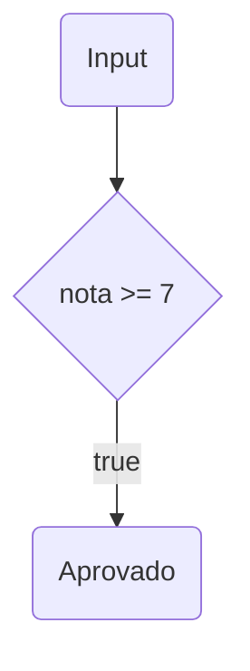
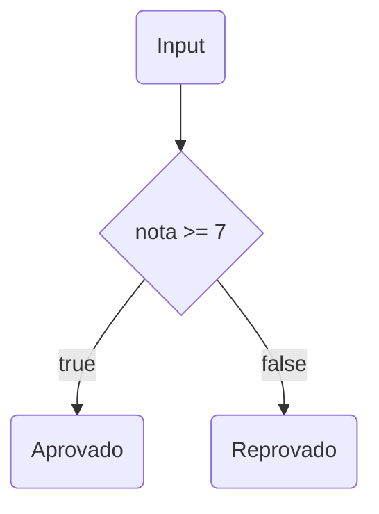
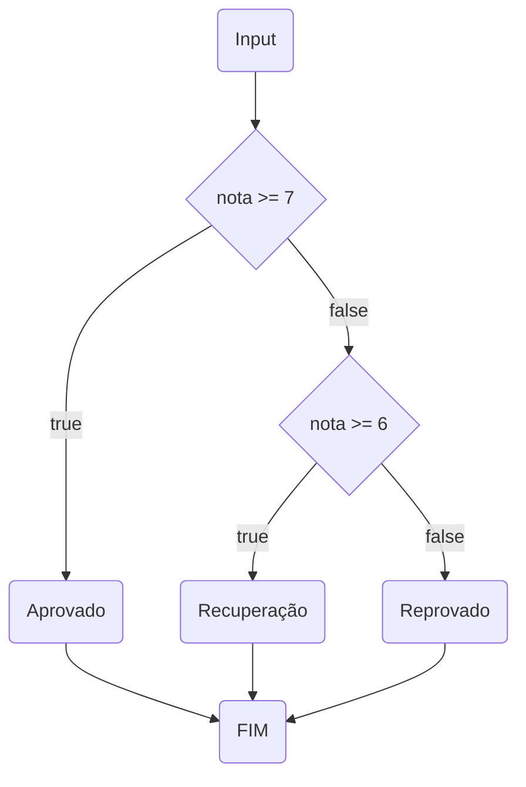
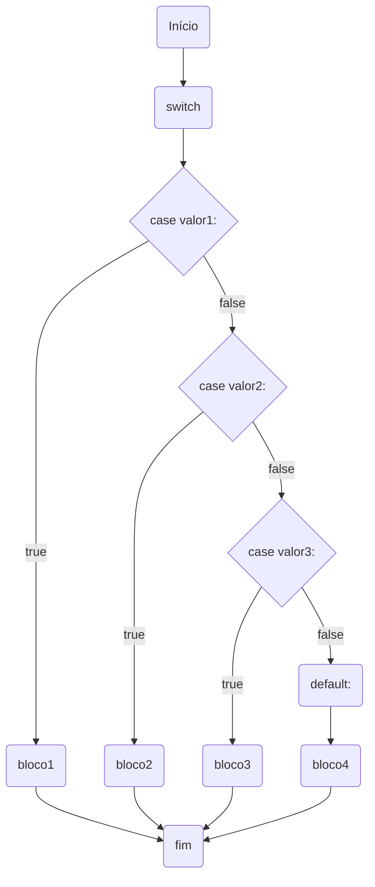
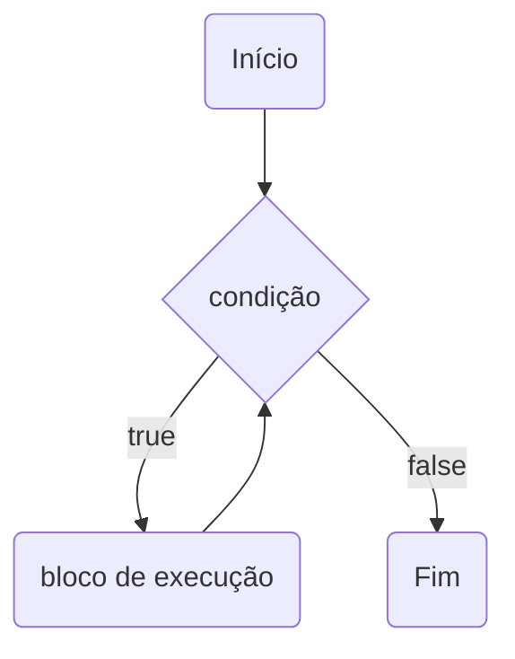
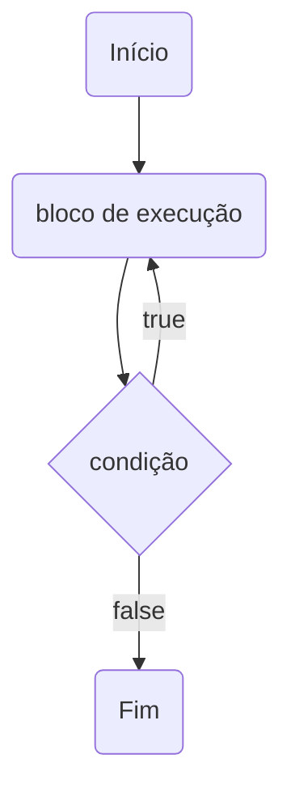

# Estruturas de Controle

**Estruturas de controle** são bem conhecidas pelos programadores de software.

**Estrutura de controle** é, na ciência da computação, uma estrutura que **desvia o fluxo** de um programa e permite realizar diferentes computações ou ações. 

Este desvio dependende de uma **condição**, que pode ser **verdadeira** ou **falsa**.

A maior dificuldade encontrada por programadores iniciantes em JavaScript referem-se
a detalhes sobre os fundamentos da linguagens.

Conhecer o funcionamento correto das estruturas de controle é essencial para evoluir em
qualquer linguagem de programação.

## 1. Estrutura **if { ... }**

A estrutura condicional **if** é um recurso que indica quais instruções o sistema deve processar de acordo com uma expressão booleana. Assim, o sistema testa se uma **condição é verdadeira** e então executa comandos de acordo com esse resultado.

É importante notar que somente serão processadas instruções dentro do bloco de código **if** que são **verdadeiras**. Não existe outra condição de execução para expressões falsas.

### Informações importantes:
- Não é obrigatório criar um bloco de código em instruções **if** que possuem apenas uma instrução a ser executada.
- Caso existam duas ou mais instruções a serem executadas dentro de uma condição **if**, coloque-as dentro de um bloco de código.
- Somente a primeira instrução de código dentro de uma estrutura **if** é executada caso não exista um bloco de código definido. As demais instruções serão executadas de forma normal, fora da estrutra **if**.

### Sintaxe 1
~~~javascript
if (condicao) {
  // bloco de código
  //instrução 1
  //instrução 2
  //instrução n...
}
~~~

### Sintaxe 2
~~~javascript
if (condicao) 
  //instrução 1 (única instrução)
~~~

### **Fluxograma 01:** Estrutura **if { ... }**
-------------------------------

### Exemplo 1:
~~~javascript
/**
 * Recebe um número e exibe um resultado
 * caso o valor seja maior ou igual a 7.0
 * @param {number} nota 
 */
function goodNews(nota) {
  if (nota >= 7) {
    console.log('Aprovado com ', nota)
  }
}

//Aprovado com 8.1
goodNews(8.1)

//Não exibe resultado
goodNews(6.1)
~~~

### Exemplo 2:
~~~javascript
/**
 * Recebe um valor e exibe um resoltado caso
 * o valor seja reconhecido como verdadeiro
 * @param {*} value 
 */
function ifTrueShow(value) {
  if (value) {
    console.log("O valor é verdadeiro... ", value)
  }
}

//Não exibe resultado
ifTrueShow()
ifTrueShow(null)
ifTrueShow(undefined)
ifTrueShow(NaN)
ifTrueShow(0)

//Exibe resultado
ifTrueShow(-1)
ifTrueShow(' ')
ifTrueShow('?')
ifTrueShow([])
ifTrueShow([1, 2])
ifTrueShow({})
~~~

### Exemplo 3:
~~~javascript
/**
 * Exibe o parametro 'value' no console caso seja
 * maior que 7.0.
 * Exibe a string 'Hello' sempre.
 * @param {number} value 
 */
function oneInstruction(value) {
  if (value > 7)
    console.log(value)
    console.log('Hello')
}

oneInstruction(6)
oneInstruction(8)
~~~

### Exemplo 4: Atenção !!!
~~~javascript
/**
 * Sempre exibe o parametro 'value' no console.
 * @param {number} value 
 */
function alwaysShow(value) {
  if (value > 7); {
    console.log(value)
  }
}

alwaysShow(1)
alwaysShow(2)
~~~

### Exemplo 5: Refatorando !!!
~~~javascript
/**
 * Sempre exibe o parametro 'value' no console.
 * Cuidado: não utilizar ";" entre a condição e o bloco de código!
 * @param {number} value 
 */
function alwaysShow(value) {
  if (value > 7)
    ; 
  {
    console.log(value)
  }
}

alwaysShow(1)
alwaysShow(2)
~~~

## 2. Estrutura **if { ... } else { ... }**

Para executar instruções diferentes para expressões **verdadeiras** e **falsas**, é utilizada a estrutura **if { ... } else { ... }**.

**if { ... }** é uma estrutura condicional que executa a afirmação, dentro do bloco, se determinada condição for **verdadeira**. 

Se for **falsa**, executa as afirmações dentro de **else { ... }**.

### Sintaxe 1
~~~javascript
if (condicao) {
  // bloco de código
  //instrução 1a
  //instrução 2a
  //instrução n...
} else {
  // bloco de código
  //instrução 1b
  //instrução 2b
  //instrução n...
}
~~~

### Sintaxe 2
~~~javascript
if (condicao) 
  //instrução 1 (única instrução)
else
  //instrução 2 (única instrução)
~~~

### **Fluxograma 02:** Estrutura **if { ... } else { ... }**
-------------------------------

### Exemplo 6:
~~~javascript
/**
 * Recebe um número e exibe 'Aprovado'
 * caso o valor seja maior ou igual a 7.0, e
 * exibe 'Reprovado' caso seja menor que 7.0
 * @param {number} nota 
 */
const printResult = function(nota) {
  if (nota >= 7) {
    console.log('Aprovado')
  } else {
    console.log('Reprovado')
  }
}

//Aprovado
printResult(8.1)

//Reprovado
printResult(6.1)

//Aprovado
printResult('9.0')

//Reprovado
printResult('Nota=9.0')
~~~

### Exemplo 7:
~~~javascript
/**
 * Recebe um número e exibe 'Aprovado'
 * caso o valor seja maior ou igual a 7.0, e
 * exibe 'Reprovado' caso seja menor que 7.0
 * @param {number} nota 
 */
const printResult = function(nota) {
  if (nota >= 7)
    console.log('Aprovado')
  else
    console.log('Reprovado')
}

//Aprovado
printResult(8.1)

//Reprovado
printResult(6.1)

//Aprovado
printResult('9.0')

//Reprovado
printResult('Nota=9.0')
~~~

## 3. Estrutura **if { ... } else if { ... } else { ... }**

A estrutura **else if { ... }** é utiliada, quando precisamos especificar uma **nova condição*** se a **condição anteriror for falsa**.

### Sintaxe 1
~~~javascript
if (condicao1) {
  //bloco de código se condicao1 for veradeira
} else if (condicao2) {
  //bloco de código executado se condicao1 for falsa e condicao2 for verdadeira. 
} else {
  //bloco de codigo executado se condicao1 e condicao2 forem falsas.
}
~~~

### Sintaxe 2
~~~javascript
if (condicao1) 
  //instrução 1 se condicao1 for veradeira
else if (condicao2)
  //instrução 2 se condicao1 for falsa e condicao2 for verdadeira. 
else
  //instrução 3 se condicao1 e condicao2 forem falsas.
~~~

### **Fluxograma 03:** Estrutura **if { ... } else if { ... } else { ... }**
-------------------------------

### Exemplo 8:
~~~javascript
/**
 * Recebe um número e exibe 'Aprovado'
 * caso o valor seja maior ou igual a 7.0, 
 * exibe 'Recuperação' caso o valor seja menor 
 * que 7.0 e maior que 4.0, e exibe 'Reprovado'
 * caso a nota seja menor que 4.0..
 * @param {number} nota 
 */
const printResult = function(nota) {
  if (nota >= 7)
    console.log('Aprovado')
  else if (nota >= 4)
    console.log('Recuperação')
  else
    console.log('Reprovado')
}

//Aprovado
printResult(8.1)

//Recuperação
printResult(6.1)

//Reprovado
printResult(3.99)
~~~

### Exemplo 9:
~~~javascript
/**
 * Recebe um número e exibe 'Aprovado'
 * caso o valor seja maior ou igual a 7.0, 
 * exibe 'Recuperação' caso o valor seja menor 
 * que 7.0 e maior que 4.0, e exibe 'Reprovado'
 * caso a nota seja menor que 4.0..
 * @param {number} nota 
 */
const printResult = function(nota) {
  if (nota >= 7) {
    console.log('Aprovado')
  } else if (nota >= 4) {
    console.log('Recuperação')
  } else {
    console.log('Reprovado')
  }
}

//Aprovado
printResult(8.1)

//Recuperação
printResult(6.1)

//Reprovado
printResult(3.99)
~~~

### Exemplo 10:
~~~javascript
/**
 * Protótio de função
 * Retorna true se número estiver entre os valores
 * 'begin' e 'end'
 * @param {number} begin 
 * @param {number} end 
 */
Number.prototype.between = function(begin, end) {
  return this >= begin && this <= end
}

/**
 * Recebe um número e exibe:
 * 'Aprovado => Quadro de Honra'  ==> se 'value' entre 9 e 10.0 
 * 'Aprovado'                     ==> se 'value' entre 7 e 8.99 
 * 'Recuperação'                  ==> se 'value' entre 4 e 6.99 
 * 'Reprovado'                    ==> se 'value' entre 0 e 3.99 
 * @param {number} value 
 */
const computeResult = function(value) {
  if (value.between(9, 10)) {
    console.log('Aprovado => Quadro de Honra')
  } else if (value.between(7, 8.99)) {
    console.log('Aprovado')
  } else if (value.between(4, 6.99)) {
    console.log('Recuperação') 
  } else if (value.between(0, 3.99)) {
    console.log('Reprovado')
  } else {
    console.log('Nota inválida')
  }
}

//Aprovado => Quadro de Honra
computeResult(10)

//Aprovado
computeResult(8.9)

//Recuperação
computeResult(6.5)

//Reprovado
computeResult(2.5)

//Nota inválida
computeResult(-1)

//Nota inválida
computeResult(11)
~~~

## 4. Estrutura **switch-case**

A estrutura condicional **switch-case** avalia uma expressão, combinando o valor da expressão para um cláusula **case**, e executa as instruções associadas ao **case**.

Se a condição for correspondida, o programa executa as instruções asssociadas. 

Se múltiplos casos corresponderem o valor, o primeiro caso que corresponder é selecionado, mesmo se os casos não forem iguais entre si.

O programa primeiro procura por um caso o qual a expressão avalie como tendo o mesmo valor que o input da expressão **(usando a comparação de igualdade estrita, ===)** transferindo assim o controle para a cláusula encontrada e em seguida execudando as instruções associadas. 

Caso nenhum caso seja correspondido, então o programa procura pela cláusula opicional **default**, que, se encontrado, tem o controle transferido à ele, executando suas instruções associadas. Se não ouver uma cláusula **default**, o programa continua a execução da instrução seguindo para o final do **switch**. 

Por convenção, a cláusula **default** é a última, **mas não é algo obrigatório**.

A instrução opcional **break** associada com cada case garante que o programa saia da condicional **switch** assim que a instrução correspondente for executada, e executa a instrução que segue logo após o **switch**. 

Caso **break** seja omitido, o programa continua a execução para a **próxima instrução** dentro de **switch**. 

### Sintaxe:
~~~javascript
switch (expressão) { //expressão será comparada as cláusulas 'case'

  case valor1:
    //Instruções executadas quando o resultado da expressão for igual á valor1
    break;

  case valor2:
    //Instruções executadas quando o resultado da expressão for igual á valor2
    break;

  default:
    //Instruções executadas quando o valor da expressão é diferente de todos os cases
    break;

}
~~~

### **Fluxograma 04:** Estrutura **switch-case**
-------------------------------

### Exemplo 11:
~~~javascript
/**
 * Recebe um número e exibe:
 * 'Aprovado => Quadro de Honra'  ==> se 'value' entre 9 e 10.0 
 * 'Aprovado'                     ==> se 'value' entre 7 e 8.99 
 * 'Recuperação'                  ==> se 'value' entre 4 e 6.99 
 * 'Reprovado'                    ==> se 'value' entre 0 e 3.99 
 * @param {number} value 
 */
const computeResult = function(value) {
  switch(Math.floor(value)) {
    case 10:
    case 9:
      console.log('Aprovado ==> Quadro de Honra')
      break
    case 8: case 7:
      console.log('Aprovado')
      break
    case 6: case 5: case 4:
      console.log('Recuperação')
      break
    case 3: case 2: case 1: case 0:
      console.log('Reprovado')
      break
    default:
      console.log('Nota invalida')
  }
}

//Aprovado => Quadro de Honra
computeResult(10)

//Aprovado
computeResult(8.9)

//Recuperação
computeResult(6.5)

//Reprovado
computeResult(2.5)

//Nota inválida
computeResult(-1)

//Nota inválida
computeResult(11)
~~~

## 5. Estrutura de Repetição **while**

A declaração **while** cria um laço que executa uma rotina especifica enquanto a condição de teste for avaliada como verdadeira. 

A condição é avaliada **antes** da execução da rotina.

### Sintaxe:
~~~javascript
while (condição) {

  //instruções de código

}
~~~

### **Fluxograma 05:** Estrutura **while**
-------------------------------

### Exemplo 12:
~~~javascript
/**
 * Retorna um valor aleatório entre 'min' e 'max'
 * @param {number} min 
 * @param {number} max 
 */
function getRandonIntegerBetween(min, max) {
  const value = Math.random() * (max - min) + min
  return Math.floor(value)
}

let option = 0

while (option != -1) {
  option = getRandonIntegerBetween(-1, 10)
  console.log(`Opção escolhida foi ${option}.`)
}

console.log('Processamento concluído!')
~~~

## 6. Estrutura de Repetição **do-while**

A declaração **do-while** cria um laço que executa uma rotina especifica enquanto a condição de teste for avaliada como verdadeira. 

A condição é avaliada **depois** da execução da rotina.

Esta estrutura garante que **pelo menos uma vez** o bloco da rotina execute antes da avaliação da condição.

### Sintaxe:
~~~javascript
do {

  //instruções de código

} while (condição)
~~~

### **Fluxograma 06:** Estrutura **do-while**
-------------------------------

### Exemplo 13:
~~~javascript
/**
 * Retorna um valor aleatório entre 'min' e 'max'
 * @param {number} min 
 * @param {number} max 
 */
function getRandonIntegerBetween(min, max) {
  const value = Math.random() * (max - min) + min
  return Math.floor(value)
}

let option = 0

do {
  option = getRandonIntegerBetween(-1, 10)
  console.log(`Opção escolhida foi ${option}.`)
} while (option != -1)

console.log('Processamento concluído!')
~~~

## 7. Estrutura de Repetição **for**

A instrução **for** cria um loop que consiste em três expressões opcionais, dentro de parênteses e separadas por ponto e vírgula, seguidas por uma declaração ou uma sequência de declarações executadas em sequência.

### Sintaxe:
~~~javascript
for ([inicialização]; [condição]; [expressão final]) {

  ///declaração

}
~~~

### Exemplo 14:
~~~javascript
//imprime de 1 a 10 no console
for (let i = 1; i <= 10; i++) {
  console.log(`i = ${i}`)
}
~~~

### Exemplo 15:
~~~javascript
//imprime os elementos do array 'notas'
const notas = [6.5, 7.2, 9.8, 8.1, 7.9]
for (let i = 0; i < notas.length; i++ ) {
  console.log(`notas = ${notas[i]}`)
}
~~~

## 8. Estrutura de Repetição **for...in**

O laço **for...in**  interage sobre propriedades enumeradas de um objeto, na ordem original de inserção.  O laço pode ser executado para cada propriedade distinta do objeto.

**Nota:** **for...in** não deve ser usado para iteração em uma **Array** onde a **ordem é importante**, visto que ele iterage em uma ordem arbitrária.

É recomendável **não adicionar**, **remover** ou **alterar** propriedades novas ao objeto durante a execução do laço (durante o loop).

### Sintaxe:
~~~javascript
for (variavel in objeto) {

  ///declaração

}
~~~

### Exemplo 16:
~~~javascript
const notas = [6.5, 7.2, 9.8, 8.1, 7.9]

//for in percorre os índices do array, e não pelos valores.
for (let i in notas) {
  console.log(i, notas[i])
}
~~~

### Exemplo 17:
~~~javascript
const notas = [6.5, 7.2, 9.8, 8.1, 7.9]

//for...in percorre os índices do array, e não pelos valores.
for (let i in notas) {
  console.log(i, notas[i])
}
~~~

### Exemplo 18:
~~~javascript
const pessoa = {
  nome: 'João',
  sobrenome: 'da Silva',
  idade: 30,
  peso: 78
}

//for...in percorre as propriedades do objeto.
for(let atributo in pessoa) {
  console.log(`${atributo} = ${pessoa[atributo]}`)
}
~~~

## 8. O comando **break**

O comando **break** encerra o loop atual (**for** ou **while**), nas estruturas **switch**, ou o loop que foi informado no **label** e transfere o controle da execução do programa para o comando seguinte.

O comando **break** inclui um **label** opcional que permite ao programa encerrar a execução da estrutura que possui o nome informado na label. 

O comando **break** deve estar dentro dessa estrutura informada no **label**. 

### Sintaxe:
~~~javascript

break [label];

~~~

### Exemplo 19:
~~~javascript
const list = [1, 2, 3, 4, 5, 6, 7, 8 ,9, 10]

//sai do laço no índice 5
//break não age dentro de 'if', apenas na 'próxima' execução do laço 'for'
for (let x in list) {
  if (x == 5) {
    break
  }
  console.log(`x = ${list[x]}`)
}
~~~

### Exemplo 20:
~~~javascript
//rotulos
//Evite utilizar rotulos !
rotulo1: 
for (let a in list) {
  for (let b in list) {
    if (a == 2 && b == 3) {
      break rotulo1
    }
    console.log(`Par = ${a}, ${b}`)
  }
}
console.log('Fim')
~~~

## 9. O comando **continue**

A palavra chave **continue** termina a atual iteração do laço em que ele se encontra ou de um laço rotulado, e continua a execução deste laço com a próxima iteração.

### Sintaxe:
~~~javascript

continue [rótulo];

~~~

### Exemplo 21:
~~~javascript
const list = [1, 2, 3, 4, 5, 6, 7, 8 ,9, 10]

//pula a execução do índice 6
for (let y in list) {
  if (y == 5) {
    continue
  }
  console.log(`x = ${list[y]}`)
}
~~~